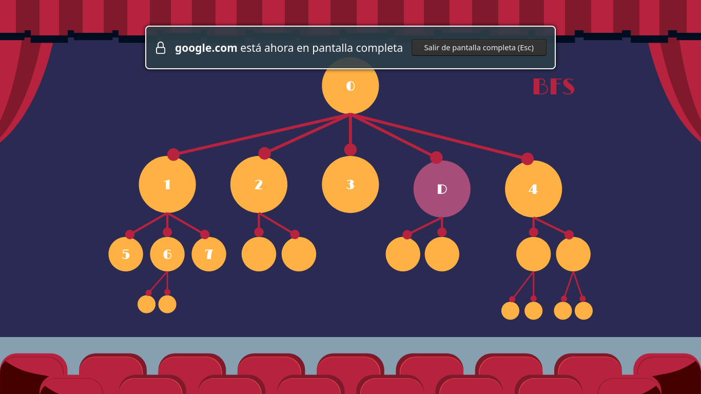
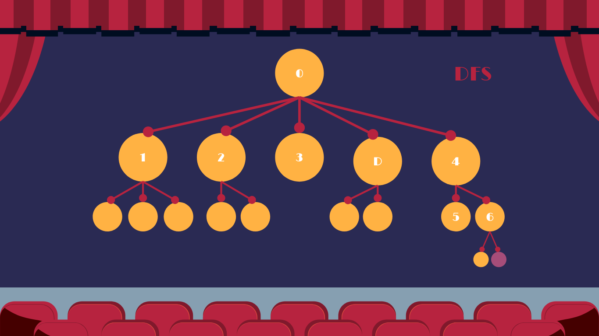

# **Problema de los Actores**

### Situación:

El presente ejercicio consiste en encontrar la relación entre dos actores de hollywood mediante la combinación [Actor-Pelicula-Actor-Pelicula-Actor] más eficiente posible. En otras palabras, encontrar el path o conjunto de solucón de actores y peliculas que permiten relaciona a un actor de origen con un actor de destino.

### Resolución:

Para poder resolver este ejercicio, se implementaron dos formas distintas, las cuales consisten en dos algoritmos de busqueda los cuales son: BFS (Búsqueda por amplitud) y DFS (Búsqueda por profundidad). Es importante aclarar que no es la única forma de resolver este problema, solo la seleccionada para hacerlo en este caso.

##### BFS

Para el caso de BFS, se utilizó la estructura de una Queue, debido a la naturaleza de esta estructura que permite realizar la búsqueda por amplitud. Al se una Queue, el elemento que se extrae es aquel que ingreso primero, o el más viejo dependiendo de como se vea. Al trabajar de esta manera, siempre se recorreran los nodos de un mismo nivel, de izquierda a derecha, dentro del árbol de nodos antes de pasar a los nodos vecinos de cada nodo.

Supongamos el ejemplo de arriba, en donde a partir del nodo 0, se agregan el nodo 1, luego el 2, el 3, el D y finalmente el 4. Al tratarse de una estructura de tipo Queue, el siguiente nodo que se extraería sería el 1, al ser el mas viejo. Con el nodo 1, se agregan a la Queue el nodo 5, luego el 6 y finalmente el 7. Aún así, el siguiente nodo que sacaríamso de la Queue sería el nodo 2, debido a que es el más viejo de todos. Por lo que siempre terminamos primero todos los nodos del mismo nivel antes de pasar a los nodos vecinos o hijos de alguno de esos nodos.

##### DFS

Por otro lado, el algoritmo de búsqueda en profundidad utiliza la estructura de tipo Stack, por lo que siempre terminaremos de analizar los nodos y nodos vecinos de este de una misma rama antes de pasar a la siguiente rama. Al ser una estructura de tipo Stack, el nodo que se extrae de esta siempre es el último que se inserto, o el más nuevo dependiendo de como se vea.

Supongamos que al igual que el anterior, partiendo del nodo 0 agregamos el los nodos 1,2,3,D y 4 en ese orden. Al ser un Stack, el nodo que extraeríamos sería el 4 debido a que es el último que insertamos. Con el 4, se incorporarían a la stack los nodos 5 y 6 como sus nodos vecinos. Debido a que el nodo 6 es el último en ser agregado es el siguiente que extraeríamos de la stack. De esa forma siempre recorreriamos toda la rama de la derecha para luego pasar a las siguientes ramas.

### Implementacón:

Para la implementación de estas soluciones, se iniciaron las siguientes estructuras:

* Una frontera que dependiendo el tipo de búsqueda que queramos hacer será de tipo Queue o de tipo Stack. En donde se irán agregando los nodos que queramos analizar.
* Una lista de nodos explorados, en donde se irán colocando los nodos que hayamos analizado para no recaer en un bucle infinito y volver a analizar un mismo nodo.
* Un nodo inicial que será el primero en ser analizado, recordando que para este problema un nodo se compone de lo siguiente:

  * State: El cual en este caso es el ID del actor.
  * Parent: Es el nodo padre.
  * Action: Es el ID de la película que víncula a este nodo con el nodo padre.

    De esta manera, el nodo inicial resultaría en lo siguiente: Como state, el ID del actor de origen y como parent y action None, debido a que es el nodo inicial.

##### Proceso

Lo primero que se debe hacer es agregar el nodo inicial a la frontera, luego se debe ingresar un loop infinito del cual saldremos únicamente si encontramos la solución o encontramos que no hay solución. Dentro del loop, existen los siguientes bloques fundamentales:

###### Frontera Vacía:

Se realiza una comprobación para ver si la frontera está vacía, si ya no hay nodos que analizar entonces quiere decir que no hay solución. En caso contrario, se extrae un nodo de la frontera para analizarlo dependiendo del tipo de búsqueda y de la estructura de la misma.

###### Solución Encontrada:

Una vez extraído el nodo, se compara el actor del state con el actor de destino para ver si es el que estamos buscando. En caso de serlo, empezaremos a agregar la tupla pelicula-actor del nodo actual a un arreglo de solución, luego de agregarlo, transformaremos nuestro nodo actual en el nodo padre de este, para ir haciendo una regresión e ir escalando niveles en el árbol para llegar al nodo incial. Por cada uno de estos iremos agregando la tupla. Una vez que encontramos que el padre de un nodo es el nodo inicial, quiere decir que tenemos el path de la solución completo y lo único que queda por hacer es invertir el arreglo para tener del lado izquierdo el actor origen y del derecho el actor destino y no viceversa. 

###### Solución no Encontrada:

En caso de que el nodo extraído de la frontera, no sea el que buscamos, lo agregamos a la lista de explorados y búscamos los nodos vecinos de este. Lo que implica identificar todas las películas en las que participo este actor y de cada película identificar todos los actores que participaron en cada una de ellas. Siempre y cuando el actor no se encuentre ya en la frontera o en la lista de explorados, se lo agregará a la frontera como nodo, teniendo como state su id, como padre el nodo que estamos analizando actualmente y como action la película en la que participó el nodo actual en la cual encontramos a dicho actor.

### Extra:

Para más información y un mayor entendimiento del funcionamiento, se recomienda ver la siguiente presentación: [https://docs.google.com/presentation/d/1hKMHW06RiqpPn2aXpbe5EwS0OASrV-jONTEK29YIiJU/edit?usp=sharing]()
