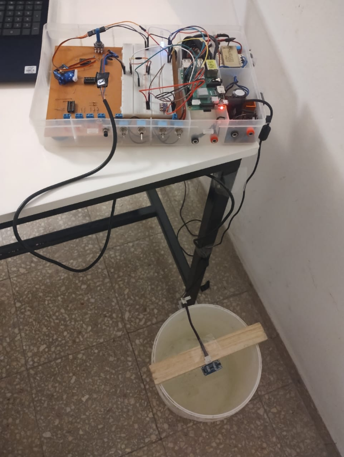

# **Floodless**
Es un proyecto de una de las materias del semestre pasado llamada SOA (Arquitectura orientada a servicios). En donde como parte de la solución se utilizó computer vision, más específicamente lo que es la detección de rostros.

## Contexto
Se debía implementar un sistema distribuido basado en una raspberry que permitiera hacer un seguimiento de la carga de líquido en un recipiente en tiempo real, brindando información como volumen, nivel, tiempo estimado de llenado, caudal y temperatura. Para esto en la raspberry se tiene conectado un sensor de temperatura y un hipersónico para calcular el nivel actual del líquido. Con toda esta información en tiempo real se van formando gráficos con información pertinente a la carga de dicho recipiente y se la va almacenando en una BD.
El sistema emite alarmas si el agua se encuentra por debajo de un umbral previamente establecido, lo mismo ocurre si está por encima. Cuando la alarma de sobrecarga se activa, se pone en marcha un mecanismo de vaciado del recipiente gracias a una bomba que se encuentra conectada a la raspberry, que transfiere el líquido a otro lado.
La parte de inteligencia artificial forma parte de la parte operativa de este sistema. Para poder utilizar el sistema, un usuario se registra con nombre, password, correo, entre otros y por otro lado se le realiza una foto para tener una referencia del mismo. Para poder operar con el sistema, es decir, iniciar la carga de un recipiente, cambiar de recipiente, registrar un recipiente, etc. Se necesita que el usuario este logeado con nombre y contraseña. Para procedimientos críticos, de emergencia, como encender o apagar la bomba manualmente, se requiere además de estar logeado un reconocimiento de rostro que debe coincidir con el registrado.

## Solución
Para la recolección de datos, se armó un programa en C que se comunica con los sensores y toma las medidas cada 5 segundos, a cada medición la publica  en un tópico de MQTT asignado. Los datos son recibidos y procesados en un flow de nodered, en donde se realizan los cálculos de las métricas necesarias, se emiten alarmas de ser necesario, se almacenan en una BD de mongoDB y son utilizados para actualizar los gráficos en tiempo real. 
La solución es un sistema distribuido debido a que la raspberry tiene la aplicación para recolección de datos, el broker de MQTT y la instancia de node-red que es el centro de toda la aplicación. El backend encargado de la autenticación y registro de los usuarios y recipientes se encuentra alojada en una instancia del IUA, mientras que el servidor flask que es el encargado de realizar las detecciones de rostro se encuentra en una PC personal.

## Server Flask
El server flask es el que se encarga de dar solución de detección de rostro, que será usado por los operativos en situaciones de emergencia para identificar su identidad.
Este brinda dos funciones, una privada meramente para los desarrolladores que se encargará de registrar a los empleados y otra pública que será la utilizada por el anterior sistema para corroborar la identidad de una persona.

### CalcularMatriz (Server Flask)
#### calcular_matriz: 
Esta función recibe como parámetro una imagen en base 64 de la persona a registrar, el sistema encargado de pasar una imagen a base64 es externo. Utilizando esta imagen la formateamos y utilizamos una modelo pre entrenado de detección de rostros de face_recognitions para que identifique el rostro y calcule la matriz asociada. La misma es formateada y es otorgada como respuesta si todo es correcto. Esta matriz que genera es la que se utilizara para asociarla a una persona una vez registrada y es lo que se utilizará como base a la hora de comprobar la identidad de una persona.

#### detectar_rostro: 
Esta función recibe como parámetro la matriz del rostro de una persona y la transcribe temporalmente en un directorio específico para que otro sistema pueda proceder con la corroboración. Una vez transcrita, ejecuta este otro sistema el cual devolverá “1” en caso de que la persona identificada coincida con la registrada, estado 403 en caso de tratarse de una persona desconocida y estado 404 en caso de alguna falla.

### IdentificaRostro (Programa ejecutado por detectar_rostro)
Realiza un proceso similar a la función calcular-matriz. Mediante face-recognitions identifica los rostros y compara la matriz original con la obtenida mediante una función de face_recognition y esto es porque la matriz no necesariamente es completamente idéntica. 
En caso de coincidir generará un “1”, en caso contrario un bounding box rodeará el rostro y aparecerá un cartel con la etiqueta de “Desconocid@”. Al pasar 10 segundos, finaliza su ejecución dando a entender que no encontró a nadie que se correspondiera con la matriz registrada.

## Marco Teórico
### Computer Vision
Disciplina de la IA que se centra en permitir que las computadoras interpreten, analicen y comprendan imágenes y videos
### Machine Learning
Rama de la IA que se centra en el desarrollo de algoritmos y modelos que permiten a las computadoras aprender a partir de datos y tomar decisiones
### Redes Neuronales
Subconjunto de algoritmos de aprendizaje de máquina inspirados en el funcionamiento del cerebro humano. Mapean entradas-salidas a partir de funciones
### Convolución de Imágenes
Técnica con el objetivo de aplicar un filtro para alterar la imagen y ayudar a la red neuronal a procesarla
### Red Neuronal Convolucional
Red neuronal que utiliza la operación de convolución para analizar imágenes. Aplica filtros para ayudar a desestimar algunas características de la imagen usando diferentes núcleos.
### OpenCV
Librería de SW open-source utilizada para aplicaciones de computer vision y ML. Desarrollada originalmente por Intel y es mantenida por una comunidad activa de desarrolladores.
### Face Recognition
Librería de python para el reconocimiento facial en imágenes y videos. Utiliza una serie de técnicas de aprendizaje profundo y se basa en el modelo de reconocimiento facial dlib.
### Dlib
Librería de SW open-source escrita en C++ que ofrece una amplia variedad de funcionalidades relacionadas con el procesamiento de imágenes y la visión por computadora.
